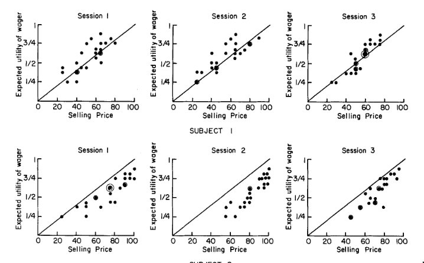

Okay so maybe I'll start by summarizing a bit from what I read in that old economics paper about the willingness to accept measure, talk about how they map that measure on to subjective value, then draw the analogy to the effort context.

## Becker et al., 1964

I'll adopt some basic notation to hopefully make things a bit clearer / more
standardized. We can think of a gamble in the following form: $(R_1, p; R_2, 1-p)$, 
where, if I accept the gamble, I receive one reward $R_1$ with probability $p$ and reward two
$R_2$ with probability $1-p$. Becker et al. created sets of gambles and for each asked subjects what's the minimum amount of money you would accept to "sell" this gamble (ie, accept the payment and not take the gamble). The selling range was between 0-100. So, for each gamble, participants choose a minimum selling price and the experimenter draws a random number between 0-100. If the random number is higher than the selling price, the participant accepts the random number as a payment and foregoes the gamble. Otherwise, the participant takes the gamble. 

Becker et al., do some math to argue that the participant's selling price of the gamble should index their subjective utility of the gamble. Best I can tell, their conception of "subjective utility" is equal to a simple expected value of the wager (ie $EV = \Sigma{p_i \cdot R_i}$ for each $i$ outcome of the wager). For me, this expected value serves as a nice, objective expectation or comparison point, and Becker et al. show that selling price largely correlates with the expected value of the wagers:

## Effort WTA

A big difference I notice with the effort-based WTA measure is that there are no longer "set" gambles that participants are assigning a selling price to. Instead, participants are sort of constructing a gamble by adjusting both probability and reward. 

So let's take the scenario where participants are faced with either performing the difficulty performed on the last set of trials vs. performing the reference difficulty. I'll call the previously-performed difficulty $e_{t-1}$ and the reference difficulty $e_r$. The wager can be framed such that the payment participants choose is the minimum they require to repeat $e_{t-1}$. We can constrain their payment (which I'll refer to as $r$) between $0 \leq r \leq 1$. So we can maybe construct the wager like this: the outcome corresponding to repeating the previous difficulty: $(e_{t-1}, 1-p, r)$ vs. the outcome referring to the reference difficulty: $(e_r, p, 0)$, where $r = p$. Right? Like I pick a reward / probability that would be minimally sufficient for me to perform $e_{t-1}$, and if the randomly drawn number is bigger than that (ie, $1-p$) then I receive my payment $r$ and perform $e_{t-1}$, otherwise at probability $p$ I receive $0$ and perform $e_r$. 

I think my biggest hangup is that now, because each outcome of the wager consists of three features $(e_\cdot, p, r)$, we can't isolate preference with respect to effort *per se* because both reward and probability are changing on each response. It's much easier for me to think about indifference revealing subjective value in a sort of one-to-one scenario, for example in Becker et al., *one* selling price for *one* gamble, or with Westbrook's Cog-ED it's a pairing of just reward and effort (ie, no probability). But in this scenario it's much harder for me to intuit what a selling price would reflect since it's totally non-independent from probability, and there's no straightforward way to plug all three features into an expected value equation to derive that sort of "rational" comparison point. Yea I can't quite pin down my concern here mathematically, but it really stems from this sense that we have three non-orthogonal factors moving here, two of which are coming from participants as a response.

So hopefully that all made sense and I'm happy to talk more about this to see if there are ways of thinking about this measure that aren't occurring to me.

