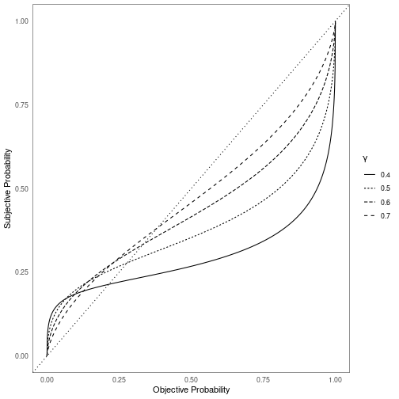

# Experiment 2 Theory

In this document I will be putting together an absolutely beautiful summary of the theory behind Experiment 2. This theory relies both on [[measurement.md]] and [[stimuli.md]].

## Prospect theory

The form of prospect theory is:

$$
V = \pi(p) \cdot v(x)
$$

Let's look more closely at the probability weighting function:

$$
\pi(p) = \frac{p^{\gamma}}{(p^{\gamma} + (1 - p)^{\gamma})^{1/\gamma}}
$$

Let's look at this function over various parameter level specifications:

This is truly profound.

