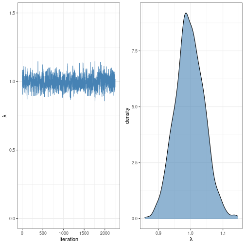

   
```r
library(tidyverse)
library(latex2exp)
library(BH)
library(rstan)
library(gridExtra)
```
   
   
# Playing with Bayes   
   
From [this](https://link.springer.com/article/10.3758/s13428-016-0746-9) paper.   
   
These are some simulations that might be relevant to [experiment2-theory.md](/not_created.md).   
   
   
```stan
data {
    int LENGTH;
    vector[LENGTH] Y;
}
parameters {
    real<lower=0> lambda;
}
model {
    real alpha;
    real beta;
    alpha <- 1.0;
    beta <- 1.0;
    lambda ~ gamma(alpha, beta);
    Y ~ exponential(lambda);
}
generated quantities {
    real pred;
    pred <- exponential_rng(lambda);
}
```
   
   
   
   
   
```r
lambda <- 1
d <- rexp(500, lambda)
len <- length(d)

fit <- stan(file = 'stan-file.stan',
            data = list(Y=d, LENGTH = len),
            warmup = 750,
            iter = 1500,
            chains = 3)
```
   
   
```
## Running /usr/lib/R/bin/R CMD SHLIB foo.c
## gcc -I"/usr/share/R/include" -DNDEBUG   -I"/home/dave/R/x86_64-pc-linux-gnu-library/4.1/Rcpp/include/"  -I"/usr/lib/R/site-library/RcppEigen/include/"  -I"/usr/lib/R/site-library/RcppEigen/include/unsupported"  -I"/home/dave/R/x86_64-pc-linux-gnu-library/4.1/BH/include" -I"/home/dave/R/x86_64-pc-linux-gnu-library/4.1/StanHeaders/include/src/"  -I"/home/dave/R/x86_64-pc-linux-gnu-library/4.1/StanHeaders/include/"  -I"/home/dave/R/x86_64-pc-linux-gnu-library/4.1/RcppParallel/include/"  -I"/home/dave/R/x86_64-pc-linux-gnu-library/4.1/rstan/include" -DEIGEN_NO_DEBUG  -DBOOST_DISABLE_ASSERTS  -DBOOST_PENDING_INTEGER_LOG2_HPP  -DSTAN_THREADS  -DBOOST_NO_AUTO_PTR  -include '/home/dave/R/x86_64-pc-linux-gnu-library/4.1/StanHeaders/include/stan/math/prim/mat/fun/Eigen.hpp'  -D_REENTRANT -DRCPP_PARALLEL_USE_TBB=1      -fpic  -g -O2 -ffile-prefix-map=/build/r-base-4A2Reg/r-base-4.1.2=. -fstack-protector-strong -Wformat -Werror=format-security -Wdate-time -D_FORTIFY_SOURCE=2 -g  -c foo.c -o foo.o
## In file included from /usr/lib/R/site-library/RcppEigen/include/Eigen/Core:88,
##                  from /usr/lib/R/site-library/RcppEigen/include/Eigen/Dense:1,
##                  from /home/dave/R/x86_64-pc-linux-gnu-library/4.1/StanHeaders/include/stan/math/prim/mat/fun/Eigen.hpp:13,
##                  from <command-line>:
## /usr/lib/R/site-library/RcppEigen/include/Eigen/src/Core/util/Macros.h:628:1: error: unknown type name ‘namespace’
##   628 | namespace Eigen {
##       | ^~~~~~~~~
## /usr/lib/R/site-library/RcppEigen/include/Eigen/src/Core/util/Macros.h:628:17: error: expected ‘=’, ‘,’, ‘;’, ‘asm’ or ‘__attribute__’ before ‘{’ token
##   628 | namespace Eigen {
##       |                 ^
## In file included from /usr/lib/R/site-library/RcppEigen/include/Eigen/Dense:1,
##                  from /home/dave/R/x86_64-pc-linux-gnu-library/4.1/StanHeaders/include/stan/math/prim/mat/fun/Eigen.hpp:13,
##                  from <command-line>:
## /usr/lib/R/site-library/RcppEigen/include/Eigen/Core:96:10: fatal error: complex: No such file or directory
##    96 | #include <complex>
##       |          ^~~~~~~~~
## compilation terminated.
## make: *** [/usr/lib/R/etc/Makeconf:168: foo.o] Error 1
## 
## SAMPLING FOR MODEL 'stan-file' NOW (CHAIN 1).
## Chain 1: 
## Chain 1: Gradient evaluation took 9e-06 seconds
## Chain 1: 1000 transitions using 10 leapfrog steps per transition would take 0.09 seconds.
## Chain 1: Adjust your expectations accordingly!
## Chain 1: 
## Chain 1: 
## Chain 1: Iteration:    1 / 1500 [  0%]  (Warmup)
## Chain 1: Iteration:  150 / 1500 [ 10%]  (Warmup)
## Chain 1: Iteration:  300 / 1500 [ 20%]  (Warmup)
## Chain 1: Iteration:  450 / 1500 [ 30%]  (Warmup)
## Chain 1: Iteration:  600 / 1500 [ 40%]  (Warmup)
## Chain 1: Iteration:  750 / 1500 [ 50%]  (Warmup)
## Chain 1: Iteration:  751 / 1500 [ 50%]  (Sampling)
## Chain 1: Iteration:  900 / 1500 [ 60%]  (Sampling)
## Chain 1: Iteration: 1050 / 1500 [ 70%]  (Sampling)
## Chain 1: Iteration: 1200 / 1500 [ 80%]  (Sampling)
## Chain 1: Iteration: 1350 / 1500 [ 90%]  (Sampling)
## Chain 1: Iteration: 1500 / 1500 [100%]  (Sampling)
## Chain 1: 
## Chain 1:  Elapsed Time: 0.010526 seconds (Warm-up)
## Chain 1:                0.009873 seconds (Sampling)
## Chain 1:                0.020399 seconds (Total)
## Chain 1: 
## 
## SAMPLING FOR MODEL 'stan-file' NOW (CHAIN 2).
## Chain 2: 
## Chain 2: Gradient evaluation took 6e-06 seconds
## Chain 2: 1000 transitions using 10 leapfrog steps per transition would take 0.06 seconds.
## Chain 2: Adjust your expectations accordingly!
## Chain 2: 
## Chain 2: 
## Chain 2: Iteration:    1 / 1500 [  0%]  (Warmup)
## Chain 2: Iteration:  150 / 1500 [ 10%]  (Warmup)
## Chain 2: Iteration:  300 / 1500 [ 20%]  (Warmup)
## Chain 2: Iteration:  450 / 1500 [ 30%]  (Warmup)
## Chain 2: Iteration:  600 / 1500 [ 40%]  (Warmup)
## Chain 2: Iteration:  750 / 1500 [ 50%]  (Warmup)
## Chain 2: Iteration:  751 / 1500 [ 50%]  (Sampling)
## Chain 2: Iteration:  900 / 1500 [ 60%]  (Sampling)
## Chain 2: Iteration: 1050 / 1500 [ 70%]  (Sampling)
## Chain 2: Iteration: 1200 / 1500 [ 80%]  (Sampling)
## Chain 2: Iteration: 1350 / 1500 [ 90%]  (Sampling)
## Chain 2: Iteration: 1500 / 1500 [100%]  (Sampling)
## Chain 2: 
## Chain 2:  Elapsed Time: 0.010308 seconds (Warm-up)
## Chain 2:                0.009874 seconds (Sampling)
## Chain 2:                0.020182 seconds (Total)
## Chain 2: 
## 
## SAMPLING FOR MODEL 'stan-file' NOW (CHAIN 3).
## Chain 3: 
## Chain 3: Gradient evaluation took 6e-06 seconds
## Chain 3: 1000 transitions using 10 leapfrog steps per transition would take 0.06 seconds.
## Chain 3: Adjust your expectations accordingly!
## Chain 3: 
## Chain 3: 
## Chain 3: Iteration:    1 / 1500 [  0%]  (Warmup)
## Chain 3: Iteration:  150 / 1500 [ 10%]  (Warmup)
## Chain 3: Iteration:  300 / 1500 [ 20%]  (Warmup)
## Chain 3: Iteration:  450 / 1500 [ 30%]  (Warmup)
## Chain 3: Iteration:  600 / 1500 [ 40%]  (Warmup)
## Chain 3: Iteration:  750 / 1500 [ 50%]  (Warmup)
## Chain 3: Iteration:  751 / 1500 [ 50%]  (Sampling)
## Chain 3: Iteration:  900 / 1500 [ 60%]  (Sampling)
## Chain 3: Iteration: 1050 / 1500 [ 70%]  (Sampling)
## Chain 3: Iteration: 1200 / 1500 [ 80%]  (Sampling)
## Chain 3: Iteration: 1350 / 1500 [ 90%]  (Sampling)
## Chain 3: Iteration: 1500 / 1500 [100%]  (Sampling)
## Chain 3: 
## Chain 3:  Elapsed Time: 0.01047 seconds (Warm-up)
## Chain 3:                0.009256 seconds (Sampling)
## Chain 3:                0.019726 seconds (Total)
## Chain 3:
```
   
   
```r
print(fit)
```
   
   
```
## Inference for Stan model: stan-file.
## 3 chains, each with iter=1500; warmup=750; thin=1; 
## post-warmup draws per chain=750, total post-warmup draws=2250.
## 
##           mean se_mean   sd    2.5%     25%     50%     75%   97.5% n_eff Rhat
## lambda    1.01    0.00 0.05    0.92    0.97    1.00    1.04    1.10   890    1
## pred      0.98    0.02 0.99    0.02    0.28    0.67    1.35    3.86  2071    1
## lp__   -498.28    0.02 0.76 -500.39 -498.44 -497.99 -497.81 -497.75  1114    1
## 
## Samples were drawn using NUTS(diag_e) at Sat Dec 24 16:32:16 2022.
## For each parameter, n_eff is a crude measure of effective sample size,
## and Rhat is the potential scale reduction factor on split chains (at 
## convergence, Rhat=1).
```
   
   
```r
mcmc_chain <- as.data.frame(fit)
mcmc_chain$iteration <- 1:(nrow(mcmc_chain))

p1 <- mcmc_chain %>% 
    ggplot(aes(x = iteration, y = lambda)) + 
    geom_line(color = 'steelblue') + 
    ylim(0,1.5) + 
    labs(
        x = 'Iteration',
        y = TeX(r'($\lambda$)')
    ) + 
    theme_bw()

p2 <- mcmc_chain %>% 
    ggplot(aes(x = lambda)) + 
    geom_density(fill = 'steelblue', alpha = .6) + 
    labs(
        x = TeX(r'($\lambda$)')
    ) + 
    theme_bw()

grid.arrange(p1, p2, nrow = 1)
```
   
   
   
   
Truly astonishing.