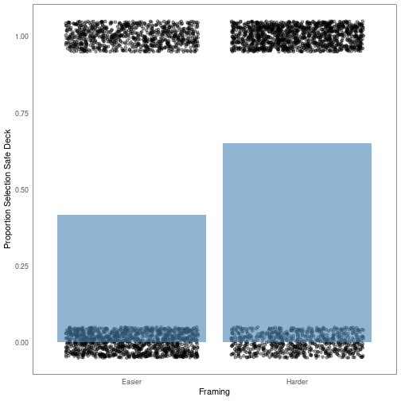

   
# Experiment 2 Theory   
   
In this document I will be putting together an absolutely beautiful summary of the theory behind Experiment 2. This theory relies both on [measurement.md](./measurement.md) and [stimuli.md](./stimuli.md).   
   
   
   
## Prospect theory   
   
The form of prospect theory is:   
   
$$   
V = \pi(p) \cdot v(x)   
$$   
### Probability weighting function   
   
Let's look more closely at the probability weighting function:   
   
$$   
\pi(p) = \frac{p^{\gamma}}{(p^{\gamma} + (1 - p)^{\gamma})^{1/\gamma}}   
$$   
   
Let's look at this function over various parameter level specifications:   
   
   
   
   
   
This is truly profound.   
   
   
### Value function   
   
The functional form of the value function is:   
   
   
$$   
v(x) = \begin{cases}   
    x^{\alpha} & \text{if } x \geq 0 \\   
   
    -\lambda \cdot (-x)^{\alpha} & \text{if } x < 0   
    \end{cases}   
$$   
   
   
   
Plot with $\lambda = 2$ and $\alpha = .65$:   
   
   
   
This is truly remarkable.   
   
**Testing more piecewise functions**   
   
Absolute value:   
   
$$   
\lvert x \rvert = \begin{cases}   
    x & \text{if } x \geq 0 \\    
   
    -x & \text{if } x < 0   
    \end{cases}   
$$   
   
Sign function:   
   
$$   
\text{sgn }x = \begin{cases}   
1 & \text{if } x > 0 \\   
0 & \text{if } x = 0 \\   
   
-1 & \text{if } x < 0   
\end{cases}   
$$   
   
   
Testing aligned functions   
   
$$   
\begin{align}   
f(x) = x^2 \\   
g(x) = ln(x) \\   
k(x) = e^x   
\end{align}   
$$