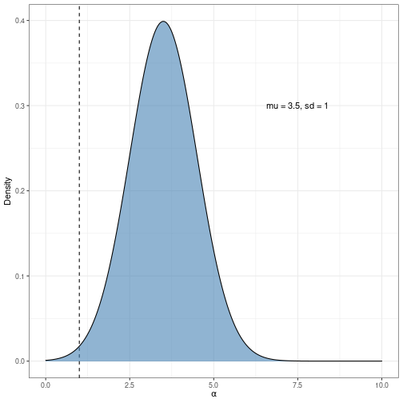

   
# Hierarchical Prospect Theory Modeling    
   
For the polished html, see [here](https://davebraun.net/gaita/ideation/structured/html/polished/hierarchical-prospect-theory.html)   
   
I'm going to start by implementing traditional prospect theory (only the value function), meaning not trying to put things in the language of an effort cost function.   
   
## Simulate data   
   
### Functional form and subject parameters   
   
Overall subjective value computation for a prospect (omitting the probability weighting function for simplicity):   
   
$$
V = \Sigma~p\cdot v(x)
$$   
   
Value function   
   
$$
v(x) = \begin{cases}
-(x)^{\alpha_i} & \text{if } x \geq 0 \\
\lambda_i(-x)^{\alpha_i} & \text{if } x < 0
\end{cases}
$$   
Where parameters $\lambda_i$ and $\alpha_i$ are specific to subject $i$.   
   
Plotting the value function with $\alpha=2.5$:   
   
   
   
   
Logistic choice rule   
   
   
$$
\begin{align*}
p(safe)_t = \frac{1}{1 + e^{-\varphi_i[V(safe_t) - V(risky_t) - \gamma_i]}}\\
Choice_t \sim Bernoulli[p(safe)_t]
\end{align*}
$$   
Where $\varphi_i$ is a decision sensitivity parameter for subject $i$ in range $[0, \infty)$ where values closer to $0$ imply choosing at random. And $\gamma$ is a baseline risk preference parameter for subject $i$ where positive values suggest a greater bias towards risk seeking and negative values towards risk aversion.   
   
   
### Group-level parameters   
   
Subject-level parameters are random effects drawn from probability distributions with group-level parameters.   
   
$$
\begin{align*}
\alpha_i \sim \mathcal{N}(\mu_{\alpha}, \sigma_{\alpha})\\
\lambda_i \sim \mathcal{N}(\mu_{\lambda}, \sigma{\lambda})\\
\varphi_i \sim \mathcal{N}(\mu_{\varphi}, \sigma_{\varphi})\\
\gamma_i \sim \mathcal{N}(\mu_{\gamma}, \sigma_{\gamma})
\end{align*}
$$   
   
So the full set of parameters to be estimated is $\{\mu_{\alpha}, \sigma_{\alpha}, \mu_{\lambda}, \sigma_{\lambda}, \mu_{\varphi}, \sigma_{\varphi}, \mu_{\gamma}, \sigma_{\gamma}\}$, where the $\mu_.$ parameters are the true population means and the $\sigma_.$ parameters are the true population variances.    
   
**Fixed values**   
   
   
   
$$
\begin{align*}
\alpha_{\mu} = 3.5\\
\alpha_{\sigma} = 1\\
\lambda_{\mu} = 2\\
\lambda_{\sigma} = 1\\
\varphi_{\mu} = 0.4\\
\varphi_{\sigma} = 0.001\\
\gamma_{\mu} = 0\\
\gamma_{\sigma} = 0.5
\end{align*}
$$   
   
   
### Simulate from generative model   
   
Let's assume the response time window is manipulated discretely, and standardized relative to individual subjects so it'll be on the scale of quantile. So let's define the space of possible prospects as ($(outcome_1, probability_1; \ldots;~outcome_n, probability_n)$):   
   
   
$$
\begin{align*}
\text{Moderate gain: }[(0, 0.5; 0.5, 0.5), (0.25, 1)]\\
\text{Moderate loss: }[(0, 0.5; -0.5, 0.5), (-0.25, 1)]\\
\text{Extreme gain: }[(0, 0.5; 1, 0.5), (0.5, 1)]\\
\text{Extreme loss: }[(0, 0.5; -1, 0.5), (-0.5, 1)]\\
\end{align*}
$$   
   
   
   
    
   
   
If I'm not missing anything obvious, these tests are pointing to the idea that probability of choice is *strongly* influenced by the absolute levels of $x$. The ordinal predictions aren't, but the effect size totally is...   
   
So the only thing I can think of is if the scale of the decision sensitivity parameter just scales proportionately with the scale of the objective outcomes, and maybe the other parameters are invariant? Because preference strength still depends on absolute level even when controlling for absolute differences in absolute outcomes. So I'm not sure. This would be a good thing to test during parameter recovery.   
   
Another interesting thing to keep an eye on is what level alpha will need to be to offset the influence of the probability weighting function discounting probability.   
   
## Modeling   
   
   
   
   
   
   
   
   
   
   
   
   
   
   
Estimation of $\gamma$ needs to be constrained in the range $[0, 1]$ in order for the model to perform well. And I think there's sufficient motivation to not worry about trying to estimate $\gamma$ because of its correlations with other parameters, especially $\alpha$. And I can use [this](https://osf.io/npd54) paper as a precedent for omitting $\gamma$.   
   
I need to look really carefully at how the likelihood function is being defined.   
These posterior distributions are stable but mostly reliably missing the true   
parameter values.   
   
   
Realized my wonky cost function coding was making things backwards.   
   
OH- the multiplier was making things all screwy because I was only applying it to the data generation and not to the model input. Ran a test to confirm that, if scaling is consistent, estimation of the parameters is robust to the scaling of inputs, which is nice and what you would expect / hope for.