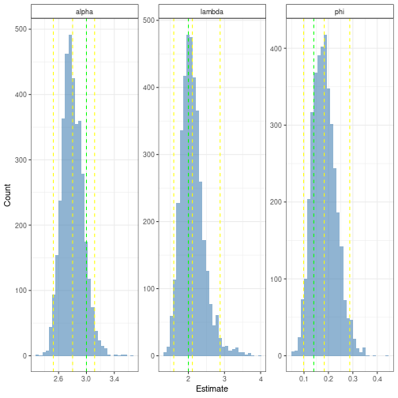

   
# Prospect Theory Modeling Tests   
   
## Simulate data   
   
I'm going to do a pretty simple simulation with a small set of parameters (not nested within subjects or anything), with the usual value function (maybe constraining $\alpha = \beta$) and a greatly simplified probability weighting function.   
   
Overall value for a prospect with two outcomes updated to include a cost function instead of value function:   
   
$$
V = \Sigma~\pi(p)\cdot -Cost(x)
$$   
   
Cost function   
   
$$
Cost(x) = \begin{cases}
-(x)^{\alpha} & \text{if } x \geq 0 \\
\lambda(-x)^{\beta} & \text{if } x < 0
\end{cases}
$$   
   
The scale of $x$ here gets a bit tricky. If I'm manipulating effort demand as a response time window, then effort demand decreases as the response window increases. I think my approach will be to flip the sign of $x$ in the function, which is a bit confusing. But I think it's more important to have the range of the cost function scale with some aversive quantity, rather than just flipping it into a value function. And of course, in keeping with prospect theory, $x$ is coded relative to a reference point.   
   
$x$ reflects the response time window, which is inversely related to objective effort demand and therefore subjective effort cost. That is to say, as there is more time to response, the task becomes less effortful. So, in keeping with mainstream views in the literature, the subjective sense of effort cost $Cost(x)$ scales as a positive, monotonic function of effort demand, which is the inverse of the response time window $-x$. And for simplicity, $\alpha = \beta$. And $\alpha > 1$ to reflect increasing sensitivity in the context of experienced costs.   
   
I'll plot this to make it more clear:   
   
   
   
   
Probability weighting function, modified for simplicity   
   
   
$$
\begin{align*}
\pi(p) = \begin{cases}
p \cdot \gamma & \text{if } p = 0.5\\
1 & \text{if } p = 1
\end{cases}\\
\gamma \in (0, 1)\\
p \in \{0.5, 1\}
\end{align*}
$$   
   
Logistic choice rule   
   
   
$$
p(safe) = \frac{1}{1 + e^{\varphi[V(risky) - V(safe)]}}
$$   
   
Where when $\varphi=0;~p(safe)=0.5$ and the choice becomes more   
deterministically in line with subjective value as $\varphi$ approaches $1$.   
   
So the full set of parameters is $\{\alpha, \lambda, \gamma, \varphi\}$.   
   
Some fixed values:   
   
   
$$
\begin{align*}
\alpha = 1.5^*\\
\lambda = 2\\
\gamma = 0.7\\
\varphi = 0.8
\end{align*}
$$   
   
\* *$\alpha>1$ reflects increasing sensitivity prediction.*   
   
### Run simulation   
   
Let's assume the response time window is manipulated discretely, and standardized relative to individual subjects so it'll be on the scale of quantile. So let's define the space of possible prospects as ($(outcome_1, probability_1; \ldots;~outcome_n, probability_n)$):   
   
   
$$
\begin{align*}
\text{Moderate gain: }[(0, 0.5; 0.5, 0.5), (0.25, 1)]\\
\text{Moderate loss: }[(0, 0.5; -0.5, 0.5), (-0.25, 1)]\\
\text{Extreme gain: }[(0, 0.5; 1, 0.5), (0.5, 1)]\\
\text{Extreme loss: }[(0, 0.5; -1, 0.5), (-0.5, 1)]\\
\end{align*}
$$   
   
   
   
    
   
   
If I'm not missing anything obvious, these tests are pointing to the idea that probability of choice is *strongly* influenced by the absolute levels of $x$. The ordinal predictions aren't, but the effect size totally is...   
   
So the only thing I can think of is if the scale of the decision sensitivity parameter just scales proportionately with the scale of the objective outcomes, and maybe the other parameters are invariant? Because preference strength still depends on absolute level even when controlling for absolute differences in absolute outcomes. So I'm not sure. This would be a good thing to test during parameter recovery.   
   
Another interesting thing to keep an eye on is what level alpha will need to be to offset the influence of the probability weighting function discounting probability.   
   
## Modeling   
   
   
   
   
   
   
   
   
   
   
```
## Inference for Stan model: 971bab69c456ef52daa4aba139d872d3.
## 3 chains, each with iter=2000; warmup=750; thin=1; 
## post-warmup draws per chain=1250, total post-warmup draws=3750.
## 
##            mean se_mean   sd     2.5%      25%      50%      75%    97.5% n_eff
## lambda     2.11    0.01 0.32     1.60     1.89     2.07     2.28     2.88  1371
## alpha      2.80    0.00 0.15     2.52     2.70     2.79     2.90     3.12  1090
## phi        0.18    0.00 0.05     0.10     0.15     0.18     0.21     0.29  1053
## lp__   -2609.37    0.04 1.34 -2613.02 -2609.89 -2609.01 -2608.44 -2607.91  1002
##        Rhat
## lambda    1
## alpha     1
## phi       1
## lp__      1
## 
## Samples were drawn using NUTS(diag_e) at Mon Jan 16 13:53:38 2023.
## For each parameter, n_eff is a crude measure of effective sample size,
## and Rhat is the potential scale reduction factor on split chains (at 
## convergence, Rhat=1).
```
   
   
   
   
   
   
   
Estimation of $\gamma$ needs to be constrained in the range $[0, 1]$ in order for the model to perform well. And I think there's sufficient motivation to not worry about trying to estimate $\gamma$ because of its correlations with other parameters, especially $\alpha$. And I can use [this](https://osf.io/npd54) paper as a precedent for omitting $\gamma$.   
   
I need to look really carefully at how the likelihood function is being defined.   
These posterior distributions are stable but mostly reliably missing the true   
parameter values.   
   
   
Realized my wonky cost function coding was making things backwards.   
   
OH- the multiplier was making things all screwy because I was only applying it to the data generation and not to the model input. Ran a test to confirm that, if scaling is consistent, estimation of the parameters is robust to the scaling of inputs, which is nice and what you would expect / hope for.